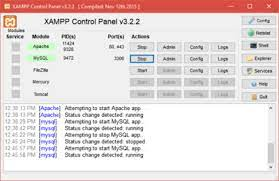

# M242_API

Benutzeranleitung Backend (XAMPP)

## Ausgangslage:

XAMPP ist installiert, Repo wurde heruntergeladen
Installationslink XAMPP: https://www.apachefriends.org/de/download.html

## Schritt 1:

Files aus dem Repo in den htdocs - folder kopieren

## Schritt 2:

XAMPP offnen und die Dienste Apache und MySQL starten

## Schritt 3: 

PHPMyAdmin offnen

## Schritt 4: 

Inhalt vom migration.sql - File kopieren, neue Datenbank im PHPMyAdmin anlegen und die kopierte SQL - Query in der Konsole ausfuhren

## Schritt 5: 

db-connection.php offnen und Datenbankzugangsdaten eingeben

